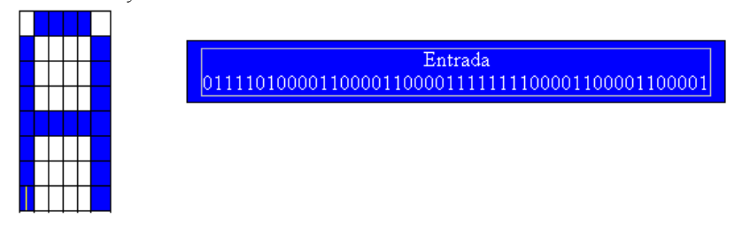

# rede-neural

<strong>Disciplina: Inteligência Artificial 2</strong> 
<strong>Alunos: Lucas Kuhn e Matheus Schenatto</strong>

<h3>O bjetivo do trabalho</h3> 

Implementar uma Rede Neural para reconhecimento de caracteres da Tabela ASCII.

<h3>Configuração</h3>

1. Linguagem → Python  
2. Ativação → Sigmoidal  
3. Momentum → 0  
4. Neurônios de entrada  → 48  
5. Neurônios intermediários → 20  
6. Neurônios de saída → 36  
7. Taxa de aprendizado → 0.7  
8. Num. de épocas → 1000  

<h3>Dataset</h3>

O dataset contém uma sequencia aleatória de 100 caracteres ASCII. Destes 100, 34% 
são do conjunto de treinamento; 20% possuem um mínimo de ruído (2 bits de diferença em relação ao
original), outros 20% contém um tipo médio de ruído (6 bits de diferença), outros 20% contém um tipo
avançado de ruído (12 bits de diferença) e 6% não fazem parte do conjunto original de treinamento.

<h3>Exemplo</h3>

